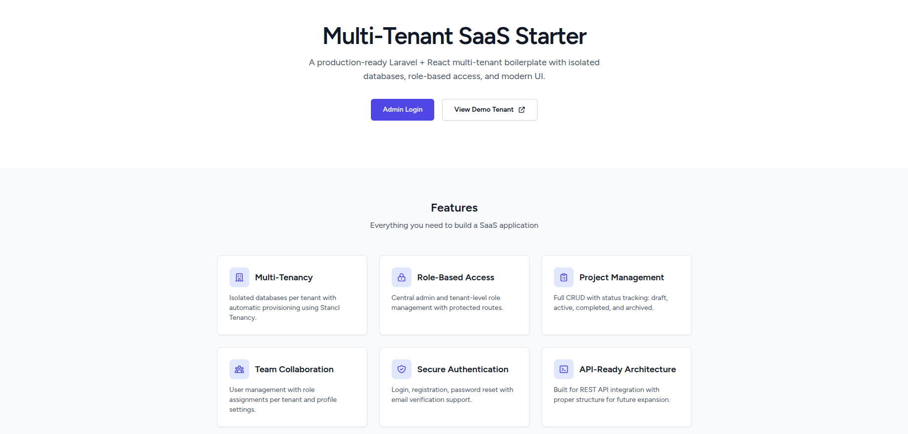
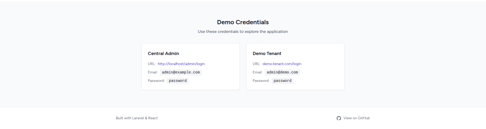
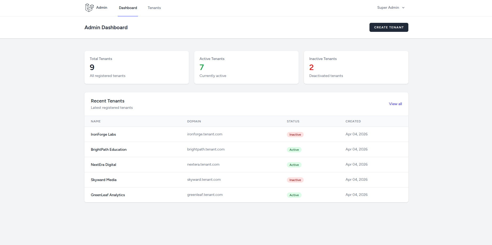
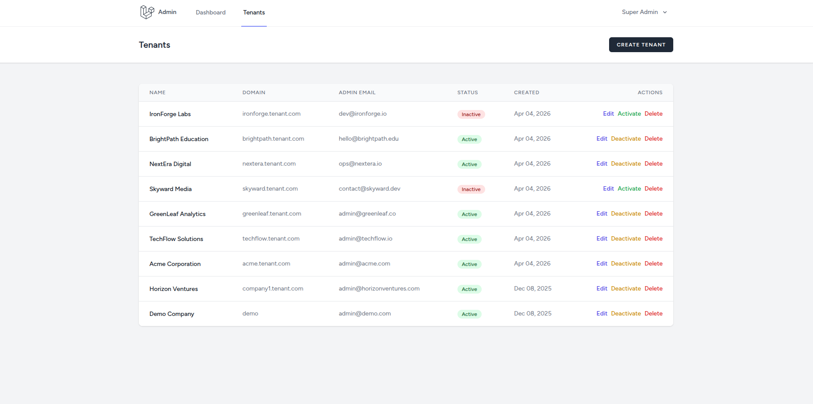
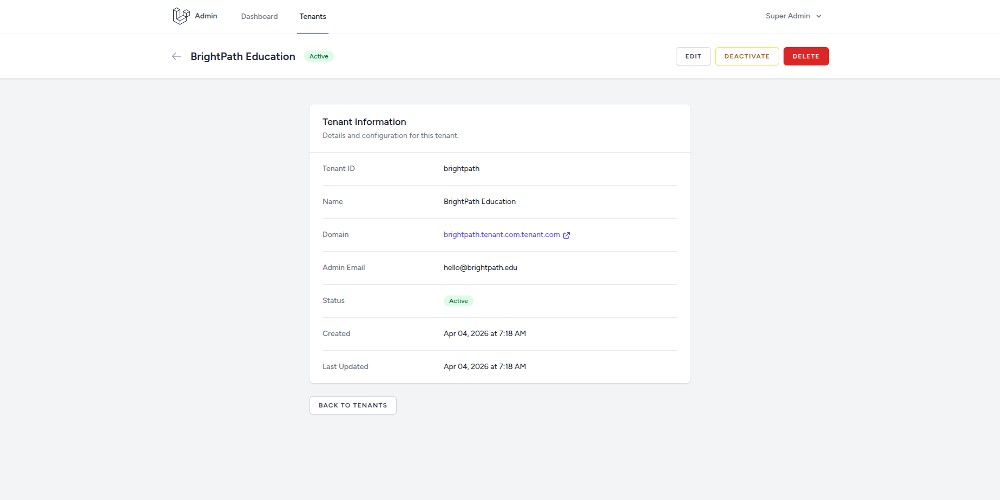
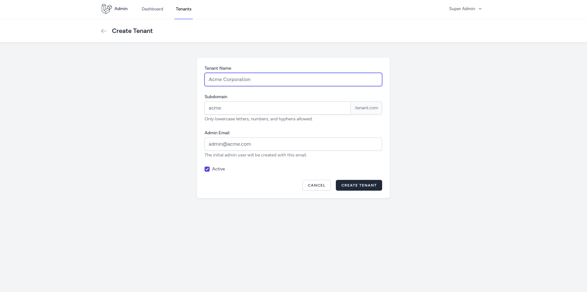
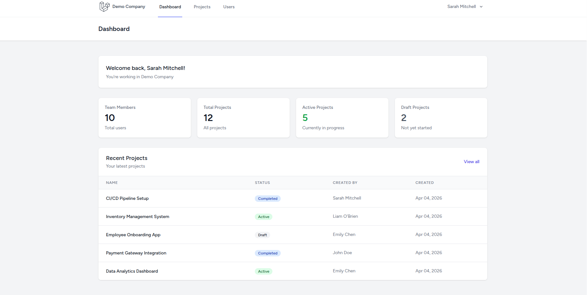
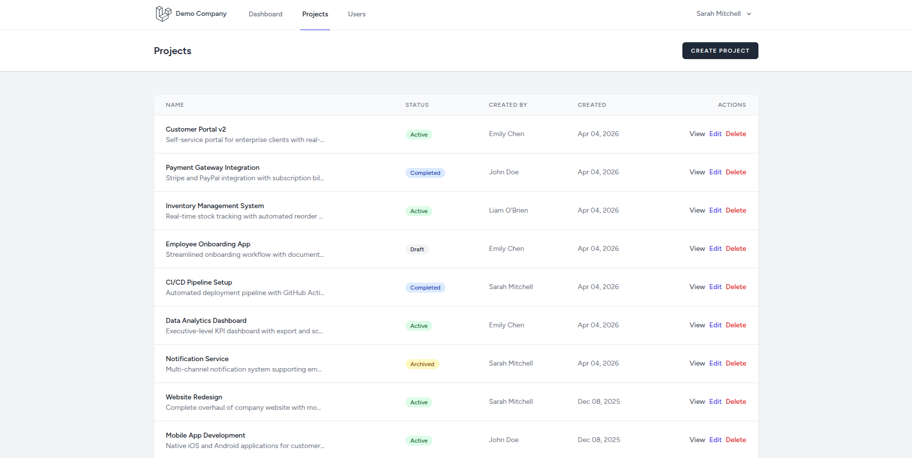
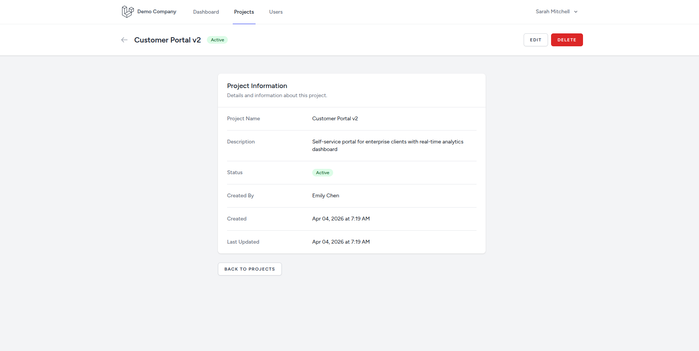
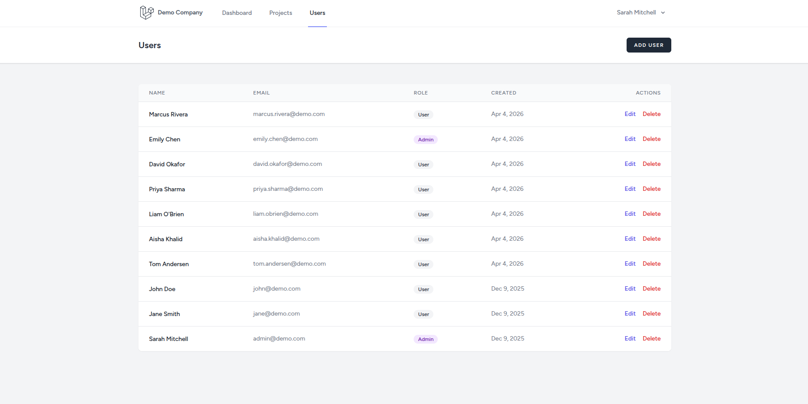

# Laravel Multi-Tenant SaaS Starter Kit

A production-inspired multi-tenant SaaS starter kit built with **Laravel 12**, **React 18**, **Inertia.js**, and **Tailwind CSS**. Features complete tenant isolation with separate databases, a central admin panel, and RESTful API support.


## Screenshots

### Landing Page




### Central Admin Panel









### Tenant Application









## Features

### Multi-Tenancy
- **Database per Tenant** - Complete data isolation using [Stancl/Tenancy](https://tenancyforlaravel.com/)
- **Subdomain Routing** - Each tenant gets their own subdomain (e.g., `acme.yourdomain.com`)
- **Automatic Database Provisioning** - Tenant databases created automatically on registration
- **Tenant-Aware Caching, Queues & Storage** - All Laravel features properly scoped

### Central Admin Panel
- Tenant management (CRUD, activate/deactivate)
- Login as tenant (impersonation with signed URLs)
- Dashboard with tenant statistics

### Tenant Application
- User authentication (login, register, password reset)
- Role-based access control (Admin & User roles)
- User management (tenant admins only)
- Project management (CRUD with status workflow: draft, active, completed, archived)

### API-Ready Architecture
- RESTful API with Laravel Sanctum authentication
- Central API for tenant management
- Tenant API for projects and users
- Service classes for business logic with resource transformers

### Tech Stack
- **Backend:** Laravel 12, PHP 8.4+
- **Frontend:** React 18 + Inertia.js
- **Styling:** Tailwind CSS
- **Database:** MySQL/PostgreSQL/SQLite (separate tenant databases)
- **Multi-Tenancy:** Stancl Tenancy (database-per-tenant)
- **Authentication:** Laravel Breeze (web) + Sanctum (API)
- **Cache/Queue:** Redis-ready

## Quick Start

### Prerequisites
- PHP 8.4+
- Composer
- Node.js 18+
- Redis
- MySQL/PostgreSQL (or SQLite for development)

### Installation

```bash
# Clone the repository
git clone https://github.com/alihamzahq/laravel-multi-tenant-saas-starter.git
cd laravel-multi-tenant-saas-starter

# Install dependencies
composer install
npm install

# Environment setup
cp .env.example .env
php artisan key:generate

# Configure your database in .env, then run migrations
php artisan migrate --seed

# Build assets
npm run build
```

### Development Server

```bash
# Start all services (server, queue, logs, vite)
composer dev
```

Or run services individually:
```bash
php artisan serve
php artisan queue:listen
npm run dev
```

## Demo Credentials

After seeding, you'll have access to:

### Central Admin
| URL | Email | Password |
|-----|-------|----------|
| `http://localhost/admin` | admin@example.com | password |

### Demo Tenant
| URL | Email | Role | Password |
|-----|-------|------|----------|
| `http://demo.localhost` | admin@demo.com | Admin | password |
| `http://demo.localhost` | john@demo.com | User | password |
| `http://demo.localhost` | jane@demo.com | User | password |

## Project Structure

```
app/
├── Http/Controllers/
│   ├── Central/          # Admin panel controllers
│   ├── Tenant/           # Tenant app controllers
│   └── Api/              # API controllers
│       ├── Tenant/       # Tenant API
│       └── Central/           # Central API
├── Models/
│   ├── Tenant.php        # Tenant model with domains
│   ├── User.php          # User model (central + tenant)
│   └── Project.php       # Tenant project model
└── Services/
    └── TenantService.php # Tenant business logic

database/
├── migrations/           # Central migrations
└── migrations/tenant/    # Tenant-specific migrations

resources/js/
├── Layouts/
│   ├── CentralLayout.jsx
│   └── TenantLayout.jsx
└── Pages/
    ├── Central/          # Admin panel pages
    ├── Tenant/           # Tenant app pages
    └── Welcome.jsx

routes/
├── web.php               # Central web routes
├── tenant.php            # Tenant web routes
├── api.php               # Central API routes
└── api-tenant.php        # Tenant API routes
```

## Configuration

### Multi-Tenancy Setup

Update your `.env` file:

```env
# Central domain(s) - comma-separated
CENTRAL_DOMAINS=yoursaas.com,www.yoursaas.com

# Base domain for tenant subdomains
APP_DOMAIN=yoursaas.com
```

### Local Development with Subdomains

Add entries to your hosts file:
```
127.0.0.1 localhost
127.0.0.1 demo.localhost
127.0.0.1 tenant1.localhost
```

Or use a tool like Laravel Valet or Herd for automatic wildcard subdomain handling.

## API Documentation

### Central API (Admin)

```bash
# Login
POST /api/v1/login
{
  "email": "admin@example.com",
  "password": "password"
}

# List tenants (authenticated)
GET /api/v1/tenants

# Create tenant
POST /api/v1/tenants
{
  "name": "Acme Corp",
  "domain": "acme",
  "admin_email": "admin@acme.com"
}

# Toggle tenant status
POST /api/v1/tenants/{id}/toggle-status
```

### Tenant API

```bash
# Login (on tenant subdomain)
POST /api/v1/login
{
  "email": "admin@demo.com",
  "password": "password"
}

# List projects
GET /api/v1/projects

# Create project
POST /api/v1/projects
{
  "name": "Website Redesign",
  "description": "Complete overhaul of company website",
  "status": "active"
}

# User management (admin only)
GET /api/v1/users
POST /api/v1/users
```

## Artisan Commands

```bash
# Seed demo tenant only
php artisan db:seed --class=DemoTenantSeeder

# Run tenant migrations
php artisan tenants:migrate

# Seed tenant databases
php artisan tenants:seed

# Run migrations for specific tenant
php artisan tenants:migrate --tenants=demo
```

## Extending the Starter Kit

### Adding a New Tenant Feature

1. Create migration in `database/migrations/tenant/`
2. Create model in `app/Models/`
3. Create controller in `app/Http/Controllers/Tenant/`
4. Add routes in `routes/tenant.php`
5. Create React components in `resources/js/Pages/Tenant/`

### Adding Central Admin Features

1. Create migration in `database/migrations/`
2. Create controller in `app/Http/Controllers/Central/`
3. Add routes in `routes/admin.php`
4. Create React components in `resources/js/Pages/Central/`

## Security

- CSRF protection on all web routes
- Sanctum authentication for APIs
- Tenant isolation at database level
- Role-based access control
- Password hashing using Laravel's secure hashing (bcrypt/argon2)
- Secure session handling with Redis

## Contributing

Contributions are welcome! Please feel free to submit a Pull Request.

1. Fork the repository
2. Create your feature branch (`git checkout -b feature/amazing-feature`)
3. Commit your changes (`git commit -m 'Add some amazing feature'`)
4. Push to the branch (`git push origin feature/amazing-feature`)
5. Open a Pull Request

## License

This project is open-sourced software licensed under the [MIT license](LICENSE).

## Acknowledgments

- [Laravel](https://laravel.com) - The PHP framework
- [React](https://react.dev) - The JavaScript library for building user interfaces
- [Stancl/Tenancy](https://tenancyforlaravel.com) - Multi-tenancy package
- [Inertia.js](https://inertiajs.com) - Modern monolith approach
- [Tailwind CSS](https://tailwindcss.com) - Utility-first CSS framework
